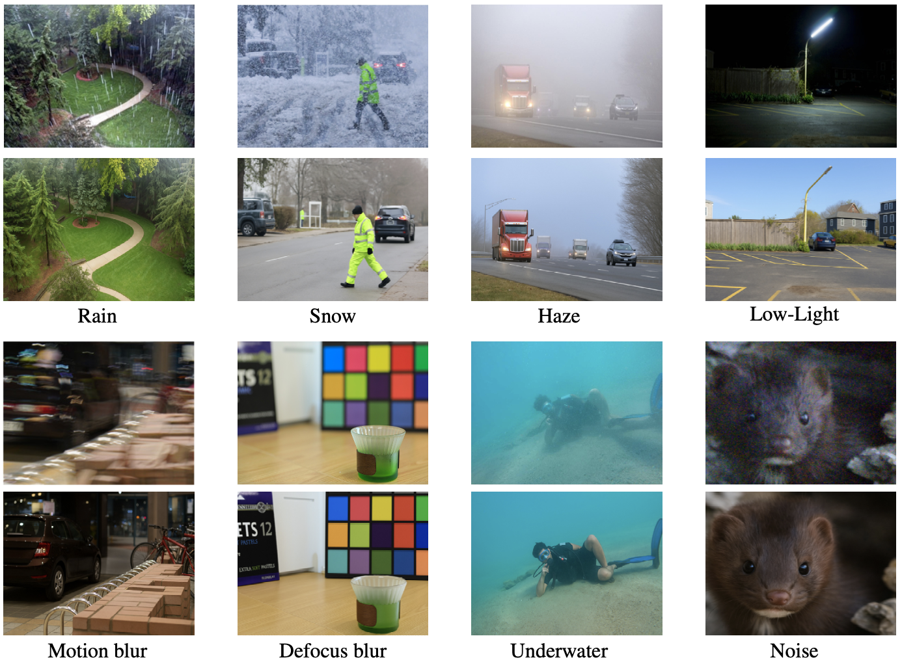

## 🧠 GPT-4o for Image Restoration

### A Preliminary Study for GPT-4o on Image Restoration

### 👥 Authors  
**Hao Yang<sup>1</sup>**, **Yan Yang<sup>2</sup>**, **Ruikun Zhang<sup>1</sup>**, **Liyuan Pan<sup>1</sup>**  
<sup>1</sup>Beijing Institute of Technology, <sup>2</sup>Australian National University   
📄 [arXiv](https://www.arxiv.org/abs/2505.05621)
📄 [Huggingface_page](https://huggingface.co/papers/2505.05621)
📦 [Dataset](https://huggingface.co/datasets/freyrigg/GPT-4o-Restore)


---

### 📜 Abstract

OpenAI's GPT-4o model, integrating multi-modal inputs and outputs within an autoregressive architecture, has demonstrated unprecedented performance in image generation. In this work, we investigate its potential impact on the image restoration community. We present the first systematic evaluation of GPT-4o across diverse restoration tasks.

Our experiments reveal that, although restoration outputs from GPT-4o are visually appealing, they often suffer from pixel-level structural fidelity when compared to ground-truth images. Common issues include variations in image proportions, shifts in object positions and quantities, and changes in viewpoint.

To address this, taking **image dehazing**, **deraining**, and **low-light enhancement** as representative case studies, we show that GPT-4o’s outputs can serve as powerful **visual priors**, substantially enhancing the performance of existing restoration networks. This study provides practical guidelines and a baseline framework to facilitate the integration of GPT-4o into future image restoration pipelines.

We hope the study on GPT-4o-based restoration will accelerate innovation in the broader field of image generation. 

---

## 🗂️ Dataset Downloads

To support further research, **we release GPT-4o-restored images from widely used image restoration datasets.**

| Dataset Name         | Restoration Task        | GPT-4o Outputs      | Original Dataset |
|----------------------|-------------------------|---------------------|------------------|
| O-Haze | Image Dehazing        | [Download 🔗](https://www.dropbox.com/scl/fi/emm6ng5tz8dfu9owwijci/O-Haze.zip?rlkey=lq8cpoecocs95mqxj4ykpc6zr&st=7rm5ry87&dl=0)     | [Source 🔗](http://www.vision.ee.ethz.ch/ntire18/o-haze/O-HAZE.zip) |
| Rain800            | Image Deraining         | [Download 🔗](https://www.dropbox.com/scl/fi/hnqkzyqek5mx460olyo2v/Rain800.zip?rlkey=a8zsdl4lh512xbvy7nyd6vkp4&st=9sq8fb1t&dl=0)     | [Source 🔗](https://github.com/hezhangsprinter/ID-CGAN) |
| LOL       | Low-Light Enhancement   | [Download 🔗](https://www.dropbox.com/scl/fi/tofjd6ewgm838ydxs75k5/LOL.zip?rlkey=ns02w0o3238unpi1sguxtavp6&st=clcz2bco&dl=0)     | [Source 🔗](https://daooshee.github.io/BMVC2018website/) |
| RainDrop               | Raindrop Removal          | [Download 🔗](https://huggingface.co/datasets/freyrigg/GPT-4o-Restore/tree/main)    | [Source 🔗](https://github.com/rui1996/DeRaindrop) |
| ISTD               | Shadow Removal          | Comming soon    | [Source 🔗](https://github.com/DeepInsight-PCALab/ST-CGAN) |
| UIEB               | UnderWater Image Enhancement          | [Download 🔗](https://huggingface.co/datasets/freyrigg/GPT-4o-Restore/tree/main)    | [Source 🔗](https://github.com/Li-Chongyi/Water-Net_Code) |
| GoPro              | Deblurring          | Comming soon    | [Source 🔗](https://seungjunnah.github.io/Datasets/gopro.html) |
| Nature20              | Reflection Removal          | [Download 🔗](https://huggingface.co/datasets/freyrigg/GPT-4o-Restore/tree/main)    | [Source 🔗](https://github.com/JHL-HUST/IBCLN) |
| DPDD              | Deblurring          | Comming soon    | [Source 🔗](https://github.com/Abdullah-Abuolaim/defocus-deblurring-dual-pixel) |


---

## 💡 Request Additional Datasets

If you are interested in seeing **GPT-4o-restored outputs** for a specific dataset that is not currently listed, please feel free to **open an issue** on our GitHub repository. We actively monitor requests and will **consider adding** commonly requested datasets in future releases. 📧 Contact: hao.yang@bit.edu.cn 

---

## 📚 Citation

If you find this work useful in your research, please consider citing:
```bibtex
@misc{yang2025preliminarystudygpt4oimage,
      title={A Preliminary Study for GPT-4o on Image Restoration}, 
      author={Hao Yang and Yan Yang and Ruikun Zhang and Liyuan Pan},
      year={2025},
      eprint={2505.05621},
      archivePrefix={arXiv},
      primaryClass={cs.CV},
      url={https://arxiv.org/abs/2505.05621}, 
}
```
